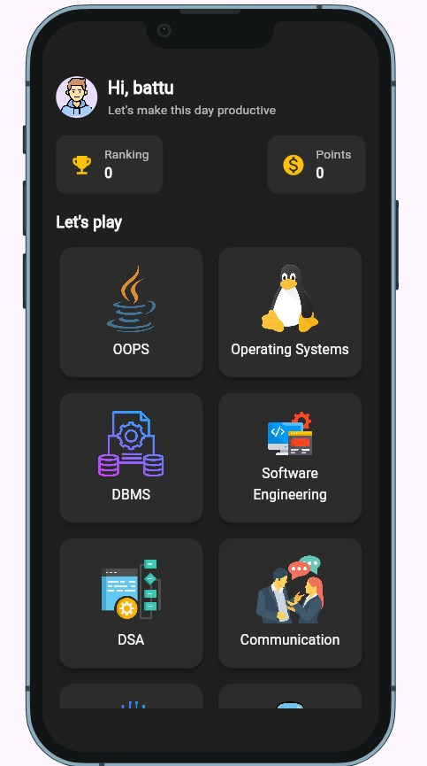

# Quiz App

A cross-platform quiz application built with **Flutter** and **Dart**. This app allows users to **check and improve their knowledge** in core computer science topics such as **Operating Systems, DBMS, Data Structures & Algorithms, Computer Networks**, and more.  

The app provides a structured, module-wise quiz system with questions ranging from **easy to hard**, helping users progressively strengthen their understanding.

## Features

- User-friendly interface for seamless navigation
- **Module-wise quizzes** covering key CS topics
- **Multiple-choice questions** with instant feedback
- **Real-time score tracking** at the end of each quiz
- **Overview section** to track which topics are covered in a test
- **Timer for each question** to simulate exam conditions
- Helps users **assess and improve their knowledge**
- Cross-platform support (Android, iOS, Web)
- Easy to extend with additional quizzes or topics

## Screenshots





## Tech Stack

- **Flutter** – Cross-platform UI framework
- **Dart** – Programming language for Flutter
- **Firebase (optional)** – Backend for storing scores and questions
- **Git & GitHub** – Version control

## Getting Started

### Prerequisites

- Flutter SDK installed: [Flutter Installation Guide](https://flutter.dev/docs/get-started/install)
- Android Studio or VS Code
- Git

### Installation & Running the App

1. Clone the repository:
```bash
git clone https://github.com/eswarramakurthi06/Quiz-App.git
